# EDA-VECELK

Application and API Service for _semantic search_ over large document collections through **Haystack** and vector database **Elasticsearch**.

## Pre-requisite

### Hardware

The application follows hardware requirements of Haystack and Elasticsearch, because due to indexing, documents processing, filtering and searching with **NLP** (Natural Language Processing) **Models**, it needs at least **8-16GB** RAM and a powerful CPU like the one described below in Configuration chapter.

### Software 

The application is compatible with **Linux**, **Windows** and **MacOS**. However, each OS requires his own measures to make the system work properly.

**Python** is the main core of the application.

### Haystack

Haystack is an open-source framework for building **search systems** that work through words and sentences' semantic similarities over large document collections.
Haystack functionalities are built using _Natural Language Processing_ Models, capable of understanding **natural human language** and perform searches by **semantic similarities**.

Recent advances in NLP have enabled the application of question answering, retrieval and summarization to real world settings and Haystack is designed to **be the bridge** between research and industry.

Haystack's core are made of **nodes**, to process informations, data, queries, answers, and **pipelines**, to envelop nodes in defined processes to obtain an result.

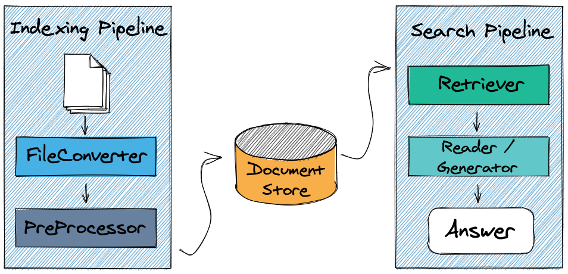

### Elastic Search

Elasticsearch is a **distributed engine** for all types of data, including textual, numerical, geospatial, structured, and unstructured.

Elasticsearch store data in **documents**, who are results of raw data processing from a variety of sources, including logs, system metrics, and web applications. After data processing, **data ingestion** is the process by which this raw data is parsed, normalized, and enriched before it is indexed in Elasticsearch.

Once indexed in Elasticsearch, users can run **complex queries** against their data and use aggregations to retrieve complex summaries of their data.

The combination of Elastic Search, Haystack and NLP Models results in a **complex** and **powerful** **search engine system** over unstructured data crawled from external sources.

Visualization of data over Elastic Search is provided by **Kibana**, which allows users to create powerful visualizations of their data, share dashboards, and manage the Elastic Stack.

### Docker


Docker Engine is an open source **containerization** technology for building and containerizing applications.
In this application context, docker is used to create, start and manage the Elastic Stack **instance**, composed by Elastic Search, Kibana and the Docker Network who envelop them.
Docker Compose permits to **manage several containers** docker. In Docker Compose are defined, by the _docker-compose.yml_ file, the services that make up and run the application in an **isolated** and **controlled** environment.

## Configuration

Development and Testing of the project are made on an **Azure Virtual Machine**.

|             | Used Configuration              |
| ----------- | ------------------------------- |
| **MACHINE** | Azure Standard D4s v3           |
| **CPU**     | Intel Xeon E5-2673 v4 (4 vCPUs) |
| **RAM**     | 16GB                            |
| **GPU**     | No                              |
| **STORAGE** | 128GB                           |

### Software

The operation of the application is provided by some dependencies of Python libraries, applications and frameworks.

Google Chrome needs to be installed on target machine. The _chrome-driver_ contained in Google Chrome application is used by **Selenium Library** in Python for the purpose of **crawl data** from websites.

### Docker

Docker Engine & Docker Compose needs to be installed on target machine.

Docker Compose runs and manage Elastic Search and Kibana Stack

#### Installation

Docker Engine can be installed by follow instruction on Docker Website:
https://docs.docker.com/engine/install/

Docker Compose can be installed by follow instruction on Docker Website:
https://docs.docker.com/compose/install/

### Elastic Search (and Kibana)

Elastic Search and Kibana images are provided by docker repositories and installation doesn't needs any action from user because the services are defined by _docker-compose.yml_ file.

Docker Compose runs containers of each image in a controlled environment and the execution needs to be managed by Docker Engine.

#### Installation

In folder _/es-stack_ is located the docker-compose configuration file, who tells docker how run the stack. Configuration file can be changed based on user needs. For example, Elastic Search execution can be clusterized on more nodes.

**docker_compose.yml**

```

version: "3"
services:
  elasticsearch:
    container_name: es-container
    image: "elasticsearch:7.9.2"
    environment:
      - xpack.security.enabled: true
    networks:
      - es-net
    ports:
      - 9200:9200
    restart: on-failure
    environment:
      - discovery.type=single-node
  kibana:
    container_name: kb-container
    image: docker.elastic.co/kibana/kibana:7.9.2
    environment:
      - ELASTICSEARCH_HOSTS=http://es-container:9200
    networks:
      - es-net
    depends_on:
      - elasticsearch
    ports:
      - 5601:5601

networks:
  es-net:
    driver: bridge
```

### Python

Python and pip (_package manager_) needs to be installed on target machine for the execution of the project.

> _Tested version: Python 3.8 & pip 20.0.2_

#### Dependecies

Project's dependencies are resolved by pip using the _requirements.txt_ file present in the root path of the project.

|              | Description                                  |
| ------------ | -------------------------------------------- |
| **Uvicorn**  | ASGI Web Server for Python.                  |
| **FastAPI**  | Web Framework for building API in Python.    |
| **Selenium** | Tool for controlling web browsing in Python. |

To install dependencies:

```
$ pip install -r requirements.txt
```

### Haystack

#### Installation

Haystack framework, within his crawler component, needs to be installed on target machine via pip.

```
$ pip install farm-haystack[crawler]
```

**Note:** For Windows you need to install _PyTorch_:

```
$ pip install farm-haystack[crawler] -f https://download.pytorch.org/whl/torch_stable.html
```

### Application

### Start services

One time all services and dependecies are configured, application can be started.

##### Run Elastic Search Stack

Docker-compose needs privileges to be executed.

Start containers in directory path where the configuration file is contained:

```
$ sudo docker-compose up
```

Elastic Search service **starts** at port **9200**

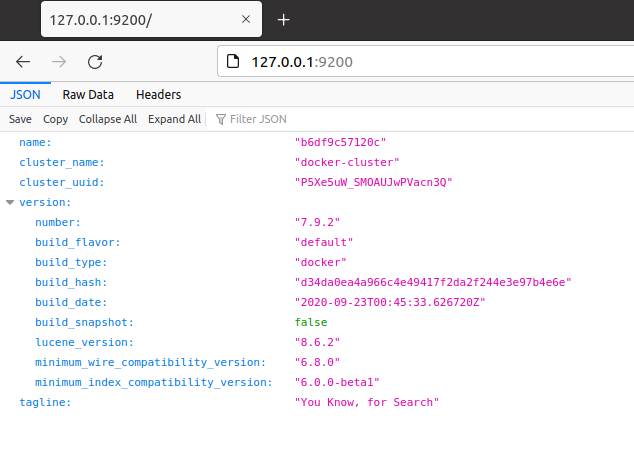

Kibana service **starts** at port **5601**

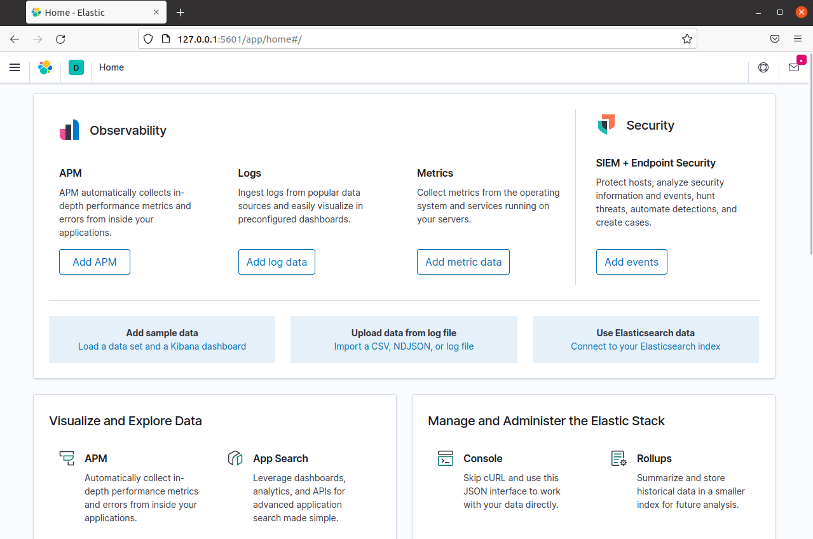

##### Run application

In project directory, run following command:

```
$ python3 server.py
```

Application will start loading NLP Models from cache or online repository.

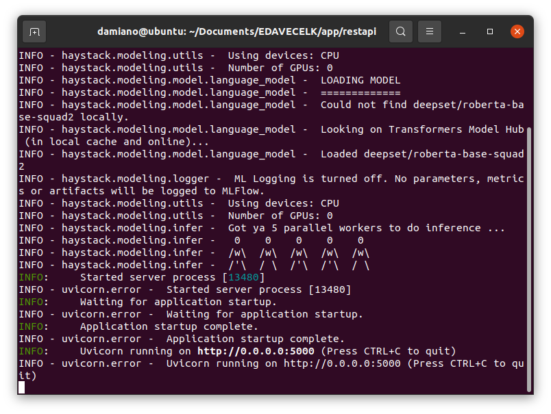

Web Server will start at **port 5000** (configurable)

## Usage

### Elastic Search

Elastic Search can be used for managing documents by **REST API**.

More details in following **documentation**.

> https://www.elastic.co/guide/en/elasticsearch/reference/current/rest-apis.html

#### Kibana

Kibana helps us providing a data visualization tool for Elastic Search.
In Kibana we see all indexes and corresponded data of Elastic Search.

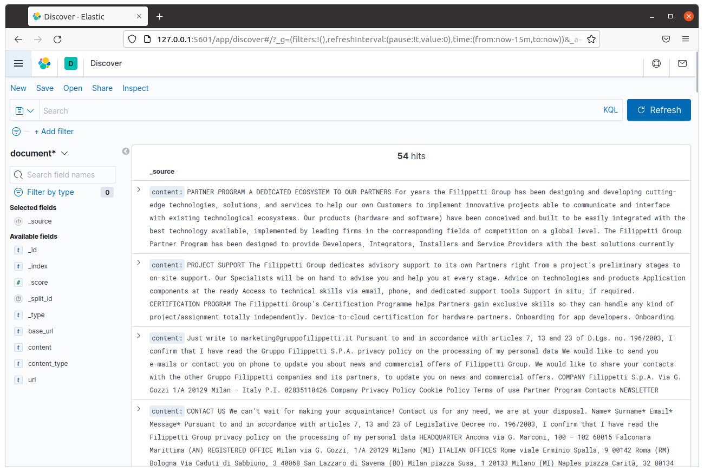

### Application

Application has implemented processes who provide to **crawl** data from a website, **process** data, **ingest** in Elastic Search and make **queries** for semantic search above all documents crawled.

Different websites can be crawled and ingested in Elastic Search. In this way the search process would be more **consistent**, by larger amount of data.

Application provides a **web service** with API Endpoints where user can interact with his functions by making HTTP Requests.

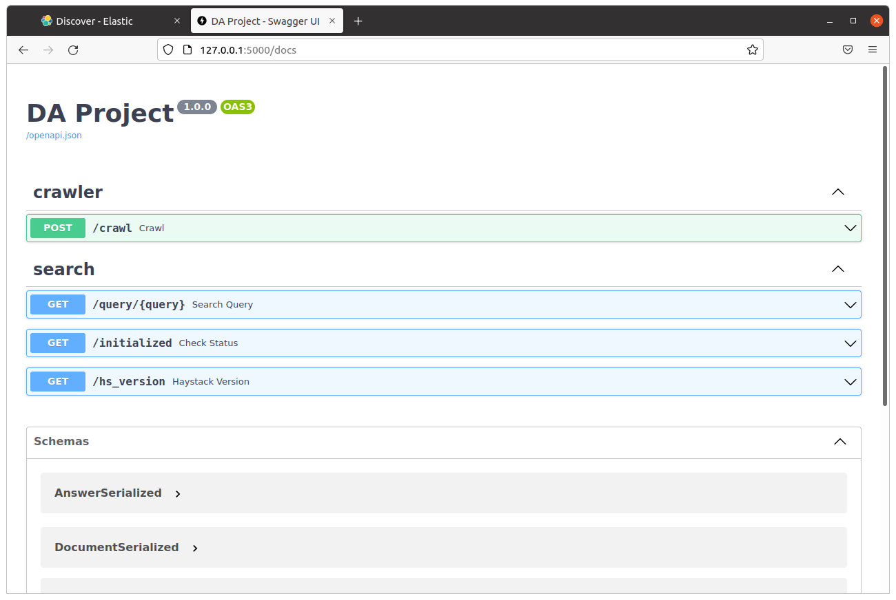

#### Crawling Websites

Crawling website procedure can be made by requesting /_crawl_ API Endpoint, specifying url and url filter.
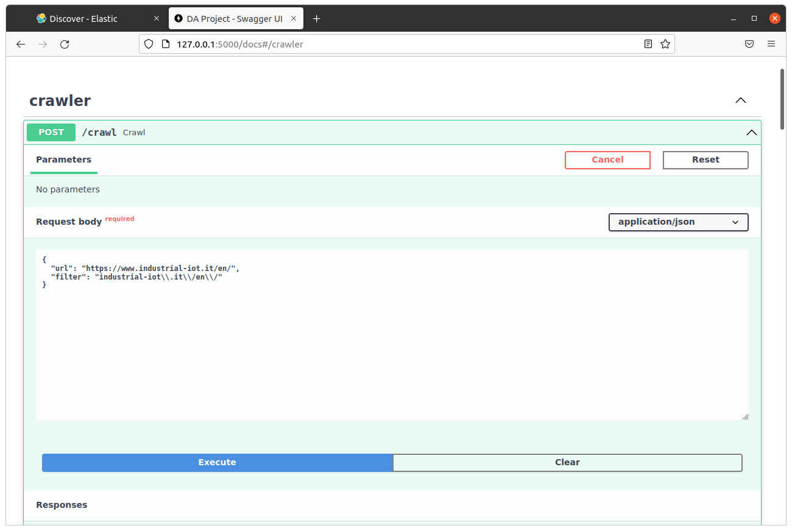

The result of web crawling will be a series of JSON Documents that will be converted in dictionaries and ingested in Document Store (Elastic Search).
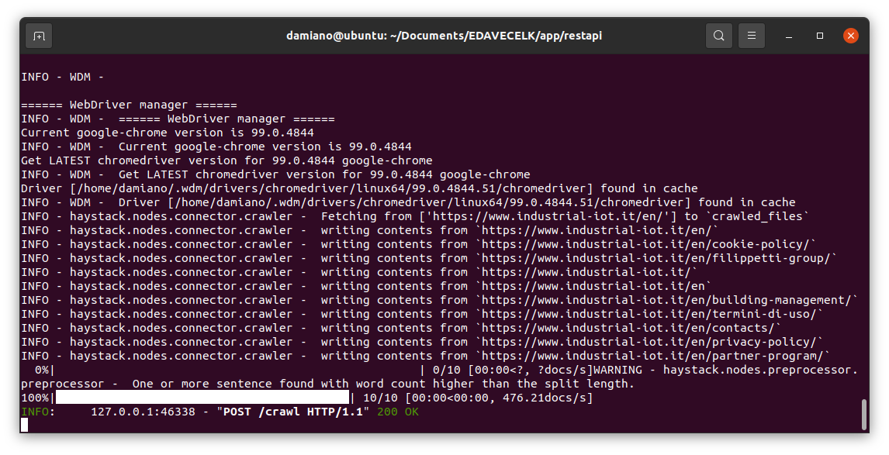

After the ingestion, the system will be ready to search above the document.

#### Querying

Querying system is made with /_query_ endpoint, specifying query to be done. Query system works better with questions instead of single keyword.

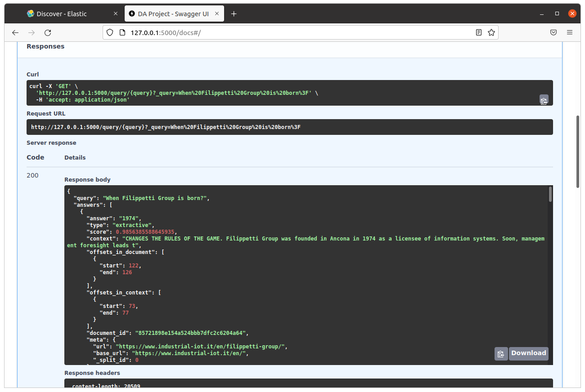

Query GET Requests will response with a JSON with:

- Query
- Answers
  - Score of reliability.
  - Context.
  - Offest in document/context.
  - Metadata of the document.

The system will give more accurated answers as the document is larger.

## Implementation

Application is implemented from scratch by Damiano Serpetta & Rizoanun Nasa for the project of Data Analytics Course in a.y. 2021/2022.

Application is entirely developed in Python, using FastAPI Library for Web Service, implemented following MVC Architecture.

The choise of implementing from scratch the application comes from the willingness to design and develop a system which is fully customizable for user's purposes and maintainable over time.

In that way, rather then using the demo, the project is prepared for future implementings and improvements based upon user requirements.

### Web Service

Web Service application is developed by using **FastAPI**, with **uvicorn** ASGI server.

A **loader** module is encharged of configuring app object, with _middlewares_ and _routers_ of application. It also provide to serve the object to main server module.

#### Schema

Requests and Responses schema are defined in _schema_ module, with classes who represents and define data object for API data exchanges.

#### Controller

Controllers defines API Endpoint Routes which accept **incoming requests** from client. In the application are defined controllers for **querying**, **scraping** and retrieve **system informations**.

#### Model

Model contains data and business logic. All classes and modules to process informations, use haystack and use elasticsearch are defined here.

Main object of Model is identified in _search_engine_ class, who, managed by controllers, provide to implement business logic and return info to controllers, who return data to clients.

### Haystack

Haystack library provides classes and modules (_called nodes_) to perform semantic searches.

Features of semantic search over documents is performed by several nodes in Haystack.

Nodes are the core components that **process** incoming text. Some perform preprocessing steps like cleaning or splitting of text while others engage transformer models to retrieve documents, summarize passages or generate questions.

Nodes are chained together using a **Pipeline**. In Haystack, there are many Nodes that you can already start using.

#### Pipeline

Pipeline implemented and used in the project is composed by two components:

- **Retriever** node is a lightweight filter that can quickly go through the full document store and pass on a set of candidate documents that are relevant to the query. When used in combination with a Reader, it is a tool for sifting out irrelevant documents, saving the Reader from doing more work than it needs to and speeding up the querying process.

- **Reader** node, also known as Open-Domain QA systems in Machine Learning speak, is the core component that enables Haystack to find the answers that you need.

The pipeline, who works on top of the document store (represented by elastic search), implements semantic search functions on the project, using it in the query endpoints.

#### Crawler

Crawler is a module who permits the **extraction** of text data from a website and nested pages contained.

Crawler component crawl URL(s), extract the text from the HTML, create a Haystack Document object out of it and save it (one JSON file per URL), including text and basic meta data. You can optionally specify via Filter Urls to only crawl URLs that match a certain pattern.

The module make use of chrome-driver for the process of data extraction from website.

### NLP Models

Natural Language Processing Models are **machine learning techniques** where human language is separated into fragments so that the grammatical structure of sentences and the meaning of words can be **analyzed** and **understood** in context.
This helps computers read and understand spoken or written text in the same way as humans.

NLP Model used in the project is pre-trained **RoBERTa** (Robustly Optimized BERT Pretraining Approach), trained on SQuAD (Stanford Question Answering Dataset).

The model is used by haystack to perform **Extractive Question & Answer Pipeline** over documents.

Various models are disponible to be used with Haystack, either pre-trained or base models.

#### Fine Tune

If you have domain-specific questions, fine-tuning your model on custom examples will very likely boost your performance. While this varies by domain, Haystack saw that ~ 2000 examples can easily increase performance by +5-20%.

Fine tuning of NLP models can be made with Haystack from **annotation tool** or **answer feedback**.

### Search Engine

Search Engine is the custom class who provides all functions and processes to do semantic search over documents.

The class respects philosophy of **separation of concerns**, is the main class of application and it manages all other classes, each for one single purpose.

In answer retriever part, an haystack pipeline is composed and built for extraction process:

- Retriever: node who filter documents in Document Store.
- Reader: a FARMReader (transformer based) is configured with RoBERTa NLP Model, who is loaded at pipeline building.

Pipeline is built at application startup and consequently executed when user requests for an answer.

### Document Store

Document Store represents the **Document management system** provided by Elastic Search Engine.

Document Store is accessed through haystack but can be accessed also from API.

Elastic Search provides mechanism of **de-normalization** and r**everse indexing** for searching improvements and better execution.

Document Store is provided by elastic class, located in _datasource/elastic.py_

Documents stored are **passed into** from this class, and its retrieved from crawler components, who download website's pages, convert into documents firstly and after in dictionaries, process text to clean it, and ingest in elastic search.

In crawler component, one time the documents are ingested in elastic search, they are removed from file system.

### API

API Service is developed by using **FASTApi** framework for Python, which works as controller for the application.

API Service starts in localhost (_configurable_) and remains listening for requests on port 5000.

Requests and responses are made through HTTP and the data exchanged is in **JSON format**, following the schema classes type.

UI Visualization of API is provided by Swagger UI, who can be reached by path **_/docs_**.

Some tests made with Postman:


## Results

Answers retrieved from Haystack in most cases meets our expectations and level of reliability of them.

Haystack needs **large datasets** to work properly and to retrieve better answers related to questions.

In test environment, we tried with dataset crawled from www.industrial-iot.it/en/ and ask some questions to the system: also if dataset is not so large, answer retrieval process works fine in that context.

We can distinguish answers reliability in some **factors**:

- Right Answer
  - Right Context
  - Wrong Context
- Wrong answer
  - Right Context
  - Wrong Context

Naturally, we can rank answers score upon those factors and correct them with NLP Model Fine-Tuning.

### Some other screenshots:

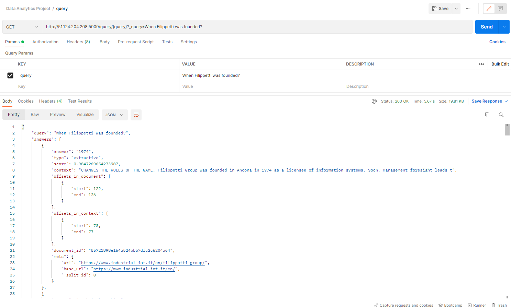
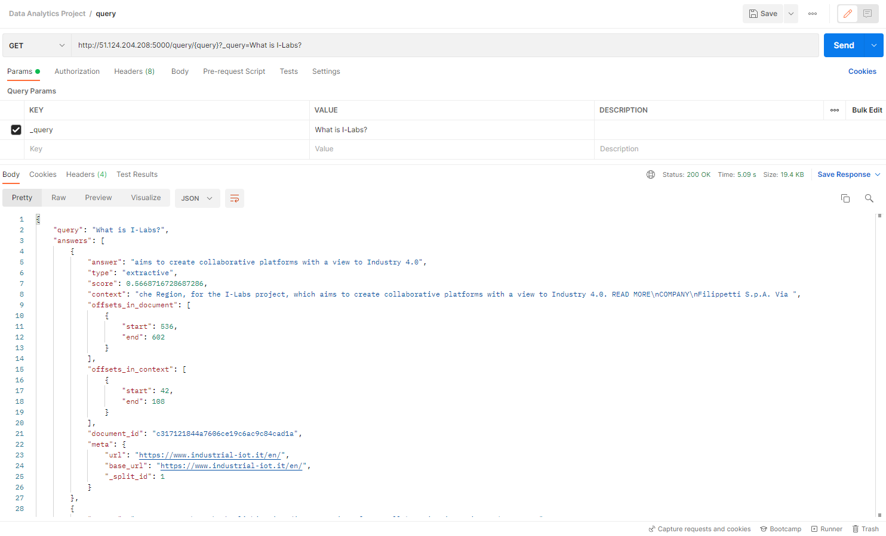

## Future Developments

Future developments concerns on how to **improve** the system and which functionalities can **extend** the application.

Fine tuning Machine Learning Models is important to retrieve better results also to **specific environment** and user requirements. How the fine tuning can be made is discussed above.

The possibilities to fine-tune an QA system are **various**. An idea for a deployed system can be taking a base model (or also pre-trained) and fine-tune it by the users that use it (providing a feedback on the answer and provide for elaborate them to train model) and by the developers with more specific and accurately fine-tune.

Crawling websites could be more **accurate**, in particular Crawler component doesn't filter by type of content on website: For example, Privacy and Cookie Policy description can be deleted from the website.

Authentication can be implemented to REST API Service: one idea can be implement **Json Web Token** (_JWT_) and develop a token-based security mechanism.

Lastly, it would be interesting to study and to do a research for usages in **real world use cases**.
